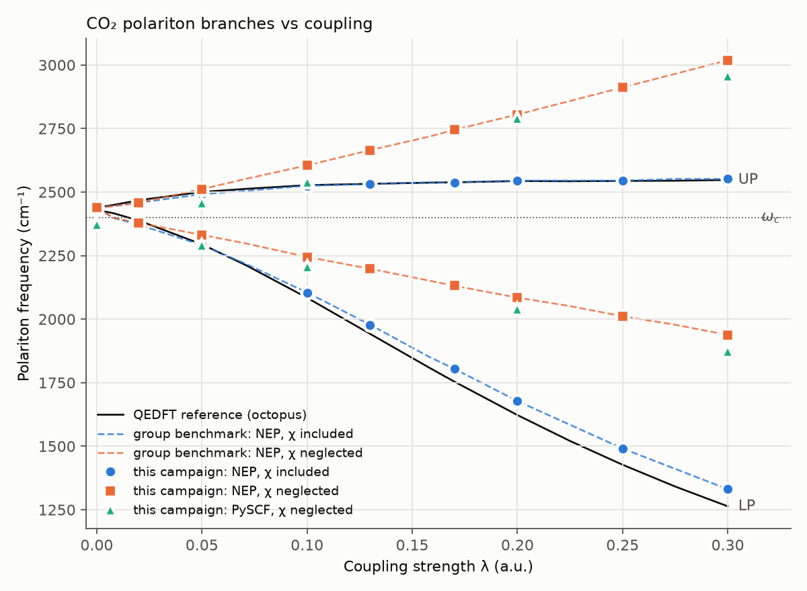
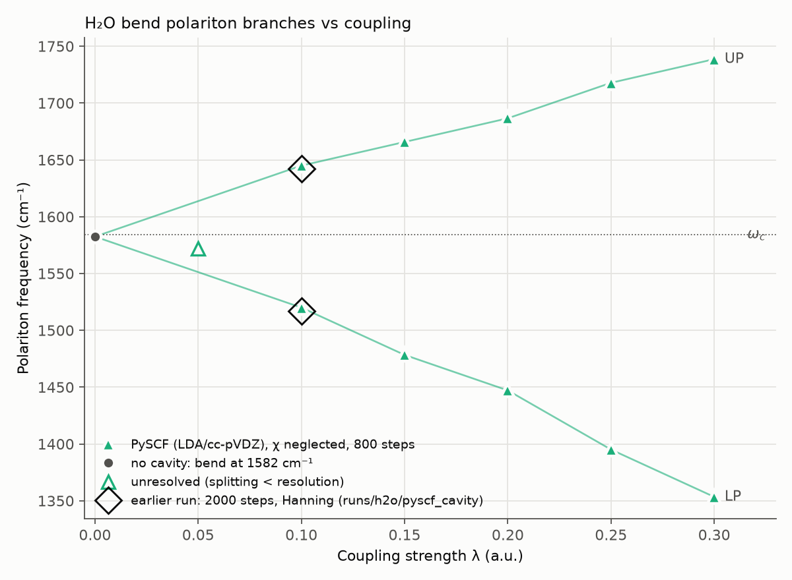

# VSC Molecular Dynamics

Cavity Born–Oppenheimer MD simulations of molecules inside optical microcavities
(vibrational strong coupling, VSC). This is Charlie Wade's personal repo for runs,
data, analysis, and write-ups. The simulations use the Flick group's shared code,
[`polaritonic_deep_md`](https://github.com/flickgroup/polaritonic_deep_md).

The shared code is **not** copied or edited here. It lives next to this repo:

```
Flick Group Code/
├── polaritonic_deep_md/      # shared group repo (read-only for me, just `git pull`)
└── VSC_Molecular_Dynamics/   # this repo
```

## Results

| Molecule | Mode | Rabi splitting (λ=0.1) |
|----------|------|------------------------|
| CO₂ | Asymmetric C–O stretch (~2349 cm⁻¹) | ~420 cm⁻¹ |
| H₂O | Bend (~1580 cm⁻¹) | 125 cm⁻¹ |

### CO₂ λ sweep (benchmark reproduction)

`runs/co2/2026-10-02_lambda_sweep/` is the CO₂ asymmetric stretch in a cavity at
ω_c = 2400 cm⁻¹ with λ = 0 to 0.3, using NEP (χ included and neglected) and PySCF
(χ neglected). Every NEP point reproduces the group benchmark
(`polaritonic_deep_md/tests/e2e/compare_with_bonini2024`) to the frequency bin.
The figures and a peak table are in
[`results/co2/2026-10-02_lambda_sweep/`](results/co2/2026-10-02_lambda_sweep/):



To re-run and re-plot:

```bash
bash scripts/campaigns/co2_lambda_sweep.sh        # nep | pyscf | all (default)
python scripts/plot_co2_sweep.py runs/co2/2026-10-02_lambda_sweep
```

### H₂O λ sweep

`runs/h2o/2026-10-02_lambda_sweep/` is the H₂O bend in a cavity at
ω_c = 1584 cm⁻¹ (polarized along x, the molecule's C₂ axis), with λ = 0 to 0.3,
using PySCF LDA/cc-pVDZ (χ neglected) at 800 steps (83 cm⁻¹ resolution). The
splitting is linear in λ (Ω_R ≈ 1265·λ cm⁻¹), and λ = 0.1 reproduces the earlier
2000-step result (125 cm⁻¹). λ = 0.05 is below resolution. Figures are in
[`results/h2o/2026-10-02_lambda_sweep/`](results/h2o/2026-10-02_lambda_sweep/):



```bash
bash scripts/campaigns/h2o_lambda_sweep.sh        # ~7 min
python scripts/plot_h2o_sweep.py runs/h2o/2026-10-02_lambda_sweep
```

### H₂O single-molecule checks (2026-10-02)

These were run before the 2–3 molecule work, at λ = 0.3 with 800 steps
(`scripts/campaigns/h2o_checks.sh`, plots from `scripts/plot_h2o_checks.py` in
[`results/h2o/2026-10-02_checks/`](results/h2o/2026-10-02_checks/)):

- **Energy conservation:** all runs conserve molecule + cavity energy at
  dt = 0.5 fs (`scripts/check_energy.py`).
- **Detuning:** there's a clear anti-crossing as ω_c is swept from 1300 to
  1850 cm⁻¹. Quantitatively, the polaritons sit about 40–60 cm⁻¹ below simple
  coupled-oscillator models. This is open: it could be anharmonicity, the
  starting amplitude, or the e-mode formulation.
- **Orientation:** this is *not* a clean cos θ test for H₂O. With the
  polarization tilted out of the molecular plane, the cavity field torques
  H₂O's permanent dipole and **the molecule rotates** (49° at θ = 30°, 113° at
  θ = 60° within 400 fs). The splitting is unaffected at θ = 0° and vanishes at
  θ = 90°. Free molecules won't keep their orientation in a multi-molecule cavity.

## Layout

| Folder        | What goes in it |
|---------------|-----------------|
| `geometries/` | Input structures (`.xyz`) |
| `runs/`       | One folder per run, `runs/<molecule>/[<campaign>/]<run-name>/`, with its `in.json` and outputs |
| `configs/`    | Run presets (defaults, molecules, drivers) used by `scripts/run.py` |
| `scripts/`    | `run.py` launcher, `campaigns/` sweep scripts, analysis and plotting scripts |
| `results/`    | Figures produced from runs |
| `reports/`    | Write-ups (`vsc_report.tex`, PDFs) |
| `docs/`       | Guide and notes |
| `large/`      | Big trajectories/checkpoints, which git ignores |

### CO₂ single-molecule checks (2026-10-02)

NEP, χ neglected, λ = 0.1, 10,000 steps (`scripts/campaigns/co2_checks.sh`, plots
from `scripts/plot_co2_checks.py` in
[`results/co2/2026-10-02_checks/`](results/co2/2026-10-02_checks/)). All 20 runs
conserve energy.

- **Amplitude:** Ω_R = 360 cm⁻¹ for initial displacements from 0.005 to 0.04 Å, so
  the runs are in the linear regime and one trajectory is enough.
- **Detuning:** the anti-crossing is fit to **2.6 cm⁻¹ rms** (below the 6.7 cm⁻¹
  resolution) by the exact linear model (vibration + cavity mode + dipole
  self-energy) with one parameter, √Λ = 359 cm⁻¹. The self-energy shifts the
  effective stretch from 2438 to 2464 cm⁻¹, so true resonance (equal LP/UP
  intensity) is about 2500 cm⁻¹, not 2438.
- **Orientation:** Ω_R follows cos θ to within about 5% up to 45°. Beyond that,
  CO₂ also **rotates away from the polarization** (10–38°), even though it has no
  permanent dipole, and the splitting collapses (73 cm⁻¹ at 60°, where cos θ
  predicts 180). Like H₂O, free molecules reorient in the cavity field.

### Runs so far

- `runs/co2/2026-10-02_lambda_sweep/`: CO₂ λ sweep, NEP + PySCF (see above)
- `runs/h2o/2026-10-02_lambda_sweep/`: H₂O λ sweep, PySCF (see above)
- `runs/h2o/2026-10-02_{orientation,detuning}/`: H₂O single-molecule checks (see above)
- `runs/co2/2026-10-02_{orientation,detuning,amplitude}/`: CO₂ single-molecule checks (see above)
- `runs/co2/{ff,nep,pyscf}`: CO₂ force-backend comparison (FF vs PySCF vs NEP dipoles)
- `runs/co2/2026-06-09_pyscf_test`, `runs/co2/co2_test_001`: early PySCF cavity test runs
- `runs/h2o/pyscf`, `runs/h2o/pyscf_cavity`: H₂O bare vs cavity spectra (bend Rabi splitting)

**Full guide: [docs/GUIDE.md](docs/GUIDE.md)**: running, where data goes, analysis tips, troubleshooting.

## Setup (once)

```bash
conda env create -f environment.yml
conda activate vsc
pip install -e ../polaritonic_deep_md
```

After that, run `conda activate vsc` in each new terminal.

## Running

`scripts/run.py` builds `in.json` from the presets in `configs/`, makes a new
dated folder in `runs/<molecule>/`, and runs `cboamd` and then `infrared` there:

```bash
python scripts/run.py h2o pyscf                            # bare molecule
python scripts/run.py h2o pyscf --cavity --lam 0.1         # cavity on resonance
python scripts/run.py co2 nep --cavity --lam 0.05 0.1 0.2  # coupling sweep
python scripts/run.py co2 ff --steps 20 --dry-run          # just print in.json
python scripts/run.py co2 pyscf --set basis=augccpvdz --name bigbasis
python scripts/run.py --help
```

Each run folder gets `in.json`, `run_info.json` (command + shared-repo commit),
`run.log`, and all cboamd outputs (`dipole.dat`, `spectrum_ase.dat`, ...).

- **Presets:** `configs/defaults.json`, `configs/molecules/<mol>.json` (geometry,
  cavity frequency in cm⁻¹, polarization), `configs/drivers/<driver>.json`. Add a
  JSON file there to add a molecule or driver.
- **NEP (CO₂)** uses the models committed in the shared repo
  (`tests/e2e/no-polar/mlip/models/`). See docs/GUIDE.md §7.

## Analysis

```bash
cd runs/h2o
python ../../scripts/compare_bend_hanning.py
```

Produces `h2o_bend_hanning.png` and `h2o_full_hanning.png`.

## Updating the shared code

```bash
cd ~/"Flick Group Code/polaritonic_deep_md" && git pull --ff-only
```

That repo has a local lock (git hooks) that blocks commits and pushes from this
machine. Pulls are unaffected. To unlock it, delete `.git/hooks/pre-commit` and
`.git/hooks/pre-push` in that repo.

## Reproducibility

Shared code was at commit `f0c0ed7` (2026-07-24) when this README was written.
Runs before that date used older versions. When starting a new run, note the
shared-repo commit (`git -C ../polaritonic_deep_md rev-parse --short HEAD`) in the
run folder.
